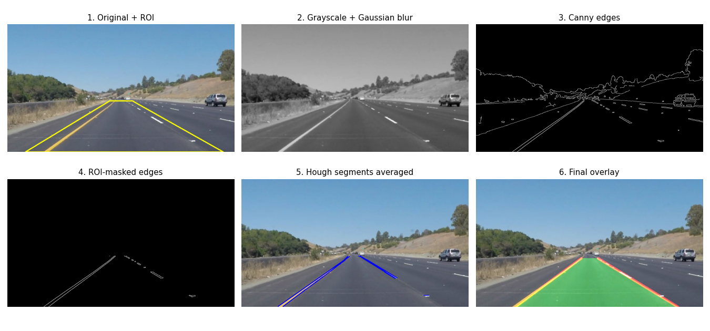
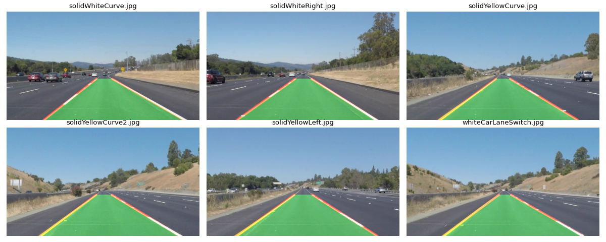

# Lane Detection using Classical Computer Vision (OpenCV)

AI Mini Project - provisional/draft. Detects left/right lane lines in road images and video with a classical OpenCV pipeline, plus temporal smoothing for stable video output.

**Team:** Sarthak Shinde - Pranav Keswad - Noel Vinod



## Pipeline
Grayscale + Gaussian blur -> Canny edges -> region-of-interest mask -> probabilistic Hough transform -> slope-based left/right averaging -> overlay (+ exponential smoothing for video).

## Results (Udacity CarND sample set)
| Video | Mode | Both lanes found | Jitter (px/frame) | FPS |
|---|---|---|---|---|
| solidWhiteRight | raw / smoothed | 100% / 100% | 4.34 / 0.90 | 82.5 / 83.7 |
| solidYellowLeft | raw / smoothed | 100% / 100% | 5.29 / 0.98 | 84.2 / 81.0 |
| challenge | raw / smoothed | 98.8% / 98.8% | 27.67 / 6.60 | 36.5 / 36.9 |

Both lanes were found on 6/6 test images. Smoothing reduces jitter about 4-5x.



## Limitations
- No ground-truth labels in this sample set, so "lanes found" is not accuracy.
- Known failure on `challenge.mp4`: left line sometimes lands on the shadowed road edge (`results/frame_challenge_90.jpg`).
- Straight-line model only approximates curves; fixed ROI; no night/rain tested.

## Run
```
pip install -r requirements.txt
git clone --depth 1 https://github.com/udacity/CarND-LaneLines-P1.git data/udacity
python run_experiments.py
jupyter notebook Lane_Detection.ipynb
```

## Streamlit demo
```
pip install -r requirements.txt
streamlit run app.py
```
Upload an image or video (or use the bundled samples), tune the pipeline with sliders, view each stage, and download results. To deploy free: push to GitHub, then create an app at share.streamlit.io pointing to `app.py`.
Live demo: https://lane-detection-opencv-miniproject-hrdxdkuu5cvhuweyu6pjvd.streamlit.app/

## Roadmap
TuSimple labelled evaluation -> curved lanes (perspective transform + polynomial fit) -> shadow robustness (HLS, CLAHE) -> U-Net comparison.

## Docs
`report/` draft report (.docx/.pdf) - `presentation/` slides (.pptx)

## Data & credits
Udacity CarND-LaneLines-P1 (https://github.com/udacity/CarND-LaneLines-P1); sample files in `samples/` come from that repo. AI assistant (Claude) used for code help and report drafting.
